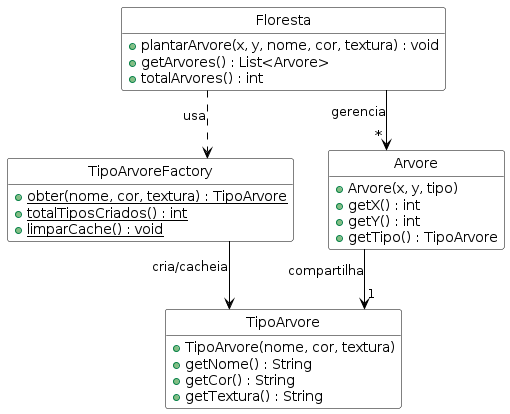

# Simulação de Floresta

Sistema que renderiza milhares de árvores em um mapa sem criar um objeto novo para cada uma — espécies iguais compartilham o mesmo tipo.

## Domínio

Uma floresta pode ter dezenas de milhares de árvores. Cada árvore tem posição única (x, y), mas espécies do mesmo tipo compartilham nome, cor e textura. Criar um objeto completo por árvore desperdiça memória; o tipo pode ser reutilizado.

## Padrão aplicado

**Flyweight** — `TipoArvore` encapsula o estado compartilhado (nome, cor, textura). `TipoArvoreFactory` mantém um cache e retorna o mesmo objeto para espécies já criadas. Cada `Arvore` guarda apenas sua posição e uma referência ao tipo compartilhado. A `Floresta` planta quantas árvores quiser com muito menos objetos na memória.

## Como rodar

```bash
cd java-Flyweight
mvn test
```

6 testes passando.

## Diagrama de classes


